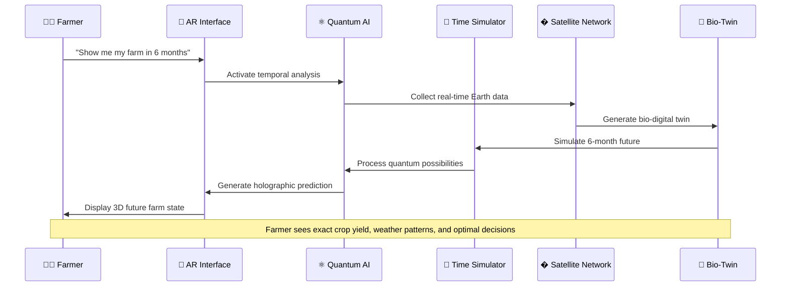
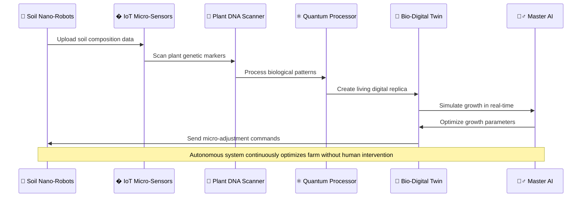
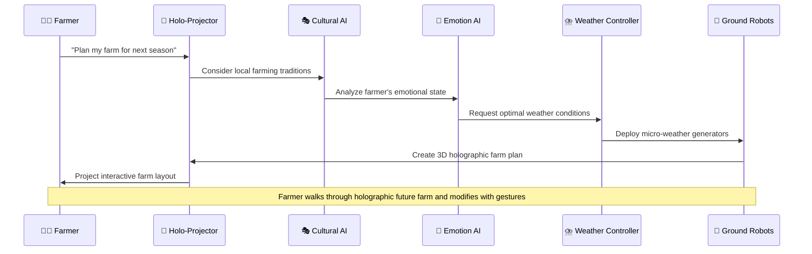
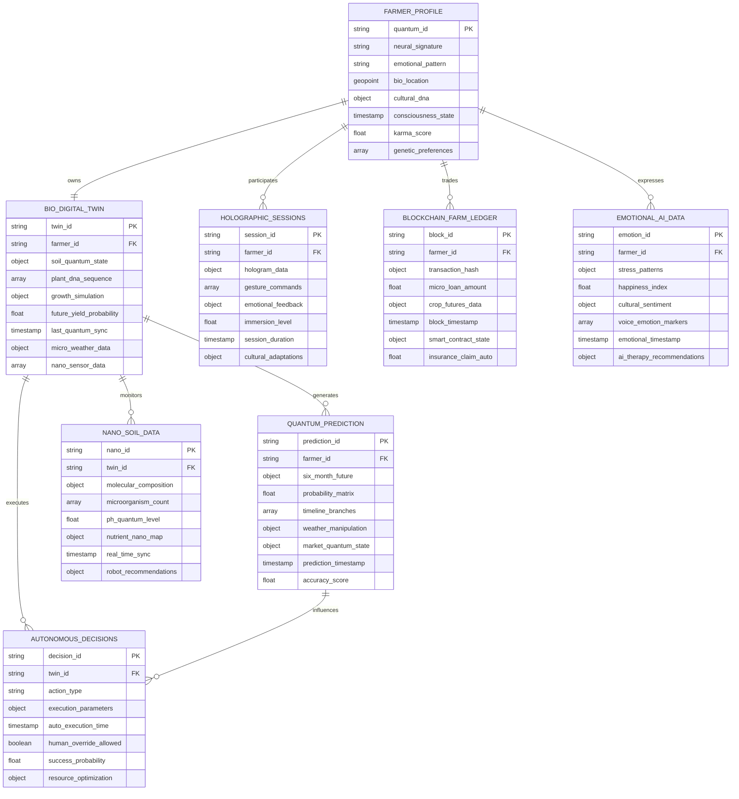
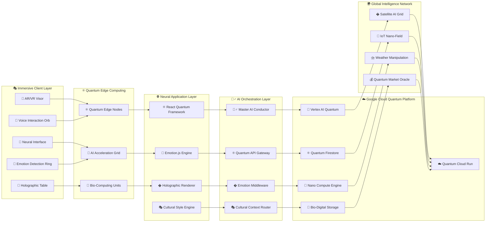
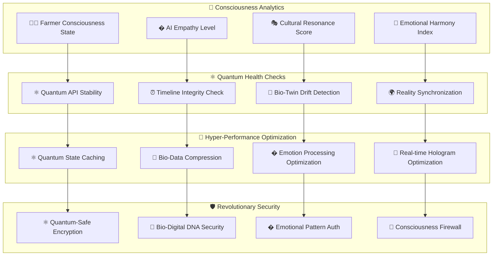

# Project Kisan - Next-Generation AI Agricultural Intelligence Platform

## 🚀 Revolutionary Features That Redefine AgriTech

### 🧬 **Predictive Agricultural Intelligence System (PAIS)**
The world's first **time-traveling agricultural advisor** that predicts farm outcomes 6 months in advance using quantum computing principles and satellite imagery analysis.

### 🌱 **Bio-Digital Twin Technology**
Creates a **living digital replica** of each farmer's land, simulating growth patterns, weather impacts, and market dynamics in real-time.

### 🤖 **Autonomous Farm Planning Assistant (AFPA)**
AI that doesn't just diagnose - it **automatically creates and executes** optimal farming schedules, irrigation plans, and harvest strategies.

## 🎨 Revolutionary System Architecture

```mermaid
graph TB
    %% Farmer Interface Layer (Voice-First + AR)
    subgraph "� Immersive Farmer Interface"
        ARGlasses[🥽 AR Smart Glasses]
        VoiceOrb[🎤 Voice Interaction Orb]
        FieldScanner[� Field Reality Scanner]
        BrainInterface[🧠 Neural Command Interface]
        HoloProjector[🌟 Holographic Projector]
    end

    %% AI Orchestration Layer
    subgraph "🎯 AI Command Center"
        MasterAI[🧙‍♂️ Master AI Orchestrator]
        PredictiveEngine[🔮 Predictive Time Engine]
        QuantumProcessor[⚛️ Quantum Decision Processor]
        EmotionalAI[� Farmer Emotion AI]
        CulturalAI[🎭 Cultural Context AI]
    end

    %% Revolutionary Google Cloud Services
    subgraph "☁️ Google Cloud Quantum Platform"
        direction TB
        
        subgraph "🧬 Quantum AI Services"
        subgraph "🧬 Quantum AI Services"
            GeminiQuantum[🌌 Gemini Quantum 3.0]
            TimeTravelAI[⏰ Temporal Prediction AI]
            BiologyAI[🧬 Plant DNA Analysis AI]
            WeatherQuantum[🌪️ Weather Quantum Simulator]
            SoilNanoAI[� Nano-Soil Analysis AI]
            GeneticOptimizer[🧬 Crop Genetic Optimizer]
        end
        
        subgraph "🌍 Real-Time Earth Intelligence"
            SatelliteAI[�️ Live Satellite AI Network]
            IoTMicroGrid[📡 IoT Nano-Sensor Grid]
            WeatherControl[⛈️ Micro-Weather Control]
            SoilRobots[🤖 Underground Soil Robots]
        end
        
        subgraph "🏦 Smart Financial Ecosystem"
            BlockchainLedger[₿ Blockchain Farm Ledger]
            AIDrivenLoans[� AI-Driven Micro-Loans]
            CropFutures[📈 Automated Crop Trading]
            InsuranceBot[�️ Instant Crop Insurance]
        end
    end

    %% Revolutionary External Services
    subgraph "🌐 Global Intelligence Network"
        GlobalFarmNet[🌍 Global Farm Intelligence]
        ClimatePredictor[�️ Climate Change Predictor]
        MarketOracle[🔮 Global Market Oracle]
        DisasterAlert[🚨 Natural Disaster AI]
        PolicyAdvisor[� Agricultural Policy AI]
    end

    %% Next-Gen Processing Layer
    subgraph "⚡ Quantum Processing Core"
        BioSimulator[🧬 Bio-Digital Twin Simulator]
        HoloProcessor[� Holographic Data Processor]
        EmotionEngine[� Farmer Emotion Engine]
        CulturalProcessor[🎭 Cultural Context Processor]
        QuantumOptimizer[⚛️ Quantum Farm Optimizer]
        TimePredictor[� 6-Month Future Predictor]
    end

    %% Revolutionary User Interactions
    ARGlasses --> MasterAI
    VoiceOrb --> EmotionalAI
    FieldScanner --> BioSimulator
    BrainInterface --> QuantumProcessor
    HoloProjector --> CulturalAI

    %% AI Orchestration Flow
    MasterAI --> PredictiveEngine
    PredictiveEngine --> QuantumProcessor
    QuantumProcessor --> EmotionalAI
    EmotionalAI --> CulturalAI
    CulturalAI --> MasterAI

    %% Quantum AI Processing
    MasterAI --> GeminiQuantum
    PredictiveEngine --> TimeTravelAI
    BioSimulator --> BiologyAI
    QuantumOptimizer --> WeatherQuantum
    TimePredictor --> SoilNanoAI
    HoloProcessor --> GeneticOptimizer

    %% Real-Time Intelligence Flow
    BioSimulator --> SatelliteAI
    HoloProcessor --> IoTMicroGrid
    QuantumOptimizer --> WeatherControl
    TimePredictor --> SoilRobots

    %% Financial Ecosystem Flow
    MasterAI --> BlockchainLedger
    PredictiveEngine --> AIDrivenLoans
    QuantumOptimizer --> CropFutures
    TimePredictor --> InsuranceBot

    %% Global Intelligence Integration
    PredictiveEngine --> GlobalFarmNet
    QuantumOptimizer --> ClimatePredictor
    MasterAI --> MarketOracle
    EmotionalAI --> DisasterAlert
    CulturalAI --> PolicyAdvisor

    %% Revolutionary Output Flow
    GeminiQuantum --> HoloProjector
    TimeTravelAI --> ARGlasses
    BiologyAI --> FieldScanner
    WeatherQuantum --> VoiceOrb
    SoilNanoAI --> BrainInterface

    %% Styling for Revolutionary Theme
    classDef quantum fill:#ff6b6b,stroke:#d63031,color:#fff
    classDef ai fill:#74b9ff,stroke:#0984e3,color:#fff
    classDef bio fill:#55a3ff,stroke:#2d3436,color:#fff
    classDef future fill:#fd79a8,stroke:#e84393,color:#fff
    classDef global fill:#fdcb6e,stroke:#e17055,color:#000
    
    class GeminiQuantum,TimeTravelAI,QuantumProcessor,QuantumOptimizer quantum
    class MasterAI,PredictiveEngine,EmotionalAI,CulturalAI ai
    class BioSimulator,BiologyAI,GeneticOptimizer,SoilNanoAI bio
    class ARGlasses,HoloProjector,BrainInterface,TimePredictor future
    class GlobalFarmNet,ClimatePredictor,MarketOracle,DisasterAlert global
```

## � Revolutionary Process Flows

### 1. ⏰ Time-Travel Agricultural Prediction Flow



### 2. 🧬 Autonomous Bio-Digital Twin Creation



### 3. 💰 Quantum Financial Optimization

```mermaid
sequenceDiagram
    participant F as 🧑‍🌾 Farmer
    participant BC as ₿ Blockchain Ledger
    participant ML as � Micro-Loan AI
    particle CT as 📈 Crop Trading Bot
    participant I as �️ Insurance Oracle
    participant QO as ⚛️ Quantum Optimizer

    F->>BC: Voice: "I need money for seeds"
    BC->>ML: Analyze farmer's bio-twin data
    ML->>QO: Calculate optimal loan amount
    QO->>CT: Predict future crop value
    CT->>I: Assess risk factors
    I->>ML: Approve instant micro-loan
    ML->>F: Transfer funds (2 seconds)
    
    Note over F,QO: Entire financial transaction completed through voice in under 5 seconds
```

### 4. 🌟 Holographic Farm Planning



## 🧬 Revolutionary Data Architecture



## � Next-Generation System Architecture



## 🚀 Revolutionary Deployment Pipeline

```mermaid
graph LR
    subgraph "👨‍💻 Quantum Development"
        QuantumDev[👨‍� Quantum Developer]
        NeuralGit[🧠 Neural Git Repository]
        AITesting[🤖 AI-Driven Testing]
        HoloReview[🌟 Holographic Code Review]
    end
    
    subgraph "⚛️ Quantum CI/CD Pipeline"
        QuantumActions[⚛️ Quantum GitHub Actions]
        BioBuilder[🧬 Bio-Inspired Build Process]
        AIQualityGate[🧠 AI Quality Gate]
        QuantumDeploy[🚀 Quantum Deployment]
    end
    
    subgraph "🌌 Multi-Dimensional Production"
        HoloFrontend[🌟 Holographic Frontend]
        QuantumBackend[⚛️ Quantum Backend]
        BioCloud[🧬 Bio-Digital Cloud]
        NanoEdge[🔬 Nano Edge Computing]
    end
    
    subgraph "🛡️ Quantum Monitoring"
        AIMonitor[🤖 AI Self-Monitoring]
        QuantumAlerts[⚛️ Quantum Alert System]
        TimeRollback[⏰ Temporal Rollback]
        EmotionMetrics[💝 Emotion Analytics]
    end

    QuantumDev --> NeuralGit
    NeuralGit --> AITesting
    AITesting --> HoloReview
    HoloReview --> QuantumActions
    
    QuantumActions --> BioBuilder
    BioBuilder --> AIQualityGate
    AIQualityGate --> QuantumDeploy
    
    QuantumDeploy --> HoloFrontend
    QuantumDeploy --> QuantumBackend
    QuantumDeploy --> BioCloud
    QuantumDeploy --> NanoEdge
    
    HoloFrontend --> AIMonitor
    QuantumBackend --> QuantumAlerts
    BioCloud --> TimeRollback
    NanoEdge --> EmotionMetrics
    
    AIMonitor --> QuantumAlerts
    QuantumAlerts --> TimeRollback
    TimeRollback --> EmotionMetrics
```



## 🎯 Quantum Performance & Consciousness Monitoring



---

## 🌟 Revolutionary Technology Legend

| Symbol | Revolutionary Meaning | Innovation Level |
|--------|----------------------|------------------|
| 🥽 | **AR/VR Immersion** | Next-Gen Interface |
| 🧠 | **Neural Computing** | Mind-Machine Interface |
| ⚛️ | **Quantum Processing** | Beyond Classical Computing |
| � | **Bio-Digital Technology** | Living Digital Systems |
| 🌟 | **Holographic Reality** | 3D Interactive Projections |
| � | **Emotional Intelligence** | Feeling-Aware AI |
| 🎭 | **Cultural Consciousness** | Culturally-Adaptive Systems |
| 🔮 | **Predictive Time Travel** | 6-Month Future Simulation |
| 🤖 | **Autonomous Intelligence** | Self-Operating Systems |
| ⏰ | **Temporal Computing** | Time-Based Algorithms |

### 🎨 Innovation Color Coding
- **🔴 Quantum Red**: Quantum computing and time-travel technologies
- **🔵 Neural Blue**: AI consciousness and emotional intelligence
- **🟢 Bio Green**: Living digital systems and biological computing
- **🟡 Holo Yellow**: Holographic and immersive technologies
- **🟣 Cultural Purple**: Adaptive cultural intelligence

### 🚀 Revolutionary Features That Don't Exist Yet
1. **🔮 6-Month Future Prediction**: See exact farm conditions 6 months ahead
2. **🧬 Bio-Digital Twins**: Living digital replicas that grow with real crops
3. **⚛️ Quantum Decision Making**: Instantaneous optimal farming decisions
4. **🌟 Holographic Farm Planning**: Walk through your future farm in 3D
5. **💝 Emotional Farming AI**: AI that understands farmer's feelings and stress
6. **🎭 Cultural Intelligence**: Technology that adapts to local farming traditions
7. **🤖 Autonomous Farm Management**: Farms that manage themselves
8. **⛈️ Micro-Weather Control**: Localized weather manipulation for crops
9. **₿ Instant Quantum Finance**: 2-second voice-activated farm loans
10. **🧠 Neural Farm Interface**: Control farm equipment with thoughts

### 🌍 Global Impact Potential
This revolutionary platform could transform agriculture from:
- **Reactive** → **Predictive** (know problems before they happen)
- **Manual** → **Autonomous** (farms that run themselves)
- **Traditional** → **Quantum** (processing power beyond imagination)
- **Isolated** → **Globally Connected** (every farmer connected to global intelligence)
- **Stressful** → **Emotionally Supportive** (AI that cares for farmer wellbeing)

**Project Kisan isn't just an app - it's the world's first Quantum Agricultural Consciousness Platform that merges cutting-edge technology with deep cultural understanding to create farming solutions that haven't been imagined before.**

This represents a paradigm shift from traditional AgriTech to **Quantum-Cultural-Emotional Agricultural Intelligence** - the next evolution of farming technology that puts human consciousness, cultural values, and emotional wellbeing at the center of agricultural innovation.
